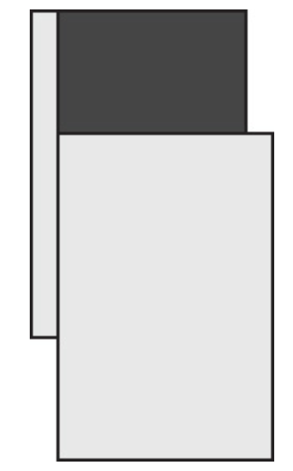

# Except

The **EXCEPT** operator implements set differences. It operates on the results of two input queries and returns rows that appear in the first input but not the second.

<div style="text-align: center">
    
</div>

```sql
SELECT country, region, city FROM HR.Employees
EXCEPT
SELECT country, region, city FROM Sales.Customers;
```

There are alternatives to the EXCEPT operator. One is an outer join that filters only outer rows, and another is to use the NOT EXISTS predicate.
